# inferex architecture

inferex is a local production LLM inference platform built to demonstrate
end-to-end inference engineering across model serving, API design,
performance optimisation, and observability.

## system diagram

## what it does

inferex accepts requests from two API schemas — OpenAI-compatible and
Anthropic-compatible — translates them through a schema normaliser into
a unified internal format, and routes them to either a vLLM or SGLang
inference engine running on a local RTX 5090 GPU. All requests are
instrumented and metrics flow into Prometheus and Grafana in real time.

## components

**API gateway (FastAPI)**
Receives all incoming requests. Validates schema, applies rate limiting,
records request timestamps for TTFT measurement, and emits metrics to
Prometheus on every call.

**Schema normaliser**
Translates OpenAI `/v1/chat/completions` and Anthropic `/v1/messages`
request formats into a single internal representation. Decouples API
compatibility from the serving backend entirely.

**vLLM engine**
Primary inference engine. Runs Llama-3.1-8B with continuous batching.
Benchmarked across FP16, AWQ, GPTQ, and FP8 quantisation levels.

**SGLang engine**
Secondary inference engine used for benchmark comparison. RadixAttention
and prefix caching enabled. Same model, same prompts — different
performance characteristics documented in FINDINGS.md.

**Observability stack**
Prometheus scrapes metrics from the gateway and both engines. Grafana
displays four panels: time to first token, tokens per second, p95 tail
latency, and GPU utilisation. Benchmark logger writes structured JSON
results to benchmarks/results/ for offline analysis.

**Kubernetes (phase 3)**
Both engines and the gateway deployed as k8s workloads on k3s with GPU
resource limits and health checks. Mirrors how Tensorix operates its
on-prem GPU fleet.

## hardware

- GPU: NVIDIA RTX 5090, 32 GB VRAM
- CPU: Intel Core Ultra 9 285K
- RAM: 64 GB
- OS: Windows 11 with WSL2 Ubuntu

## design decisions

**Why two API schemas?**
Production inference platforms increasingly need to serve multiple client
types without changing the backend. The normaliser layer demonstrates
this abstraction cleanly.

**Why vLLM and SGLang?**
These are the two dominant open-source inference frameworks in 2026.
Running both on identical hardware and workloads produces meaningful
benchmark comparisons rather than synthetic numbers.

**Why local on-prem rather than cloud?**
Mirrors the Tensorix deployment model. Also demonstrates GPU resource
management decisions that matter in real infrastructure.

## findings

See [FINDINGS.md](./FINDINGS.md) for benchmark results and analysis.